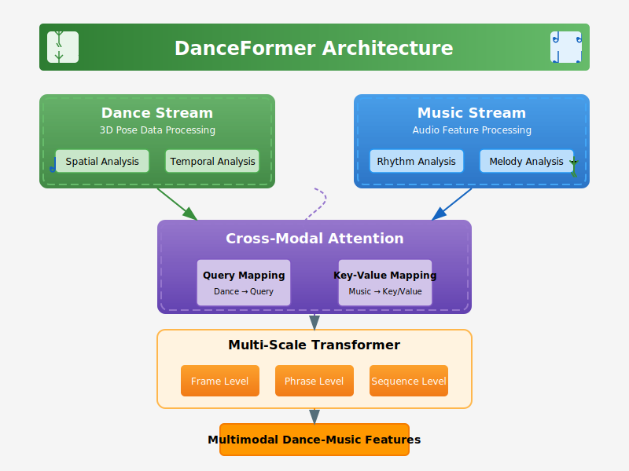
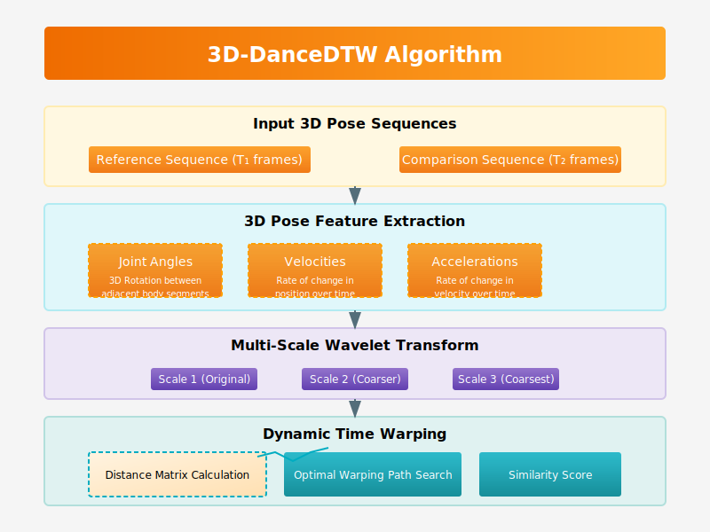

# 3D-DanceMotionAI: High-Precision 3D Pose Estimation-based AI Dance Choreography Analysis and Evaluation System

<div align="center">
  
</div>

## Overview

3D-DanceMotionAI is a state-of-the-art framework for dance choreography analysis and evaluation using advanced artificial intelligence techniques. By leveraging adaptive graph transformer networks, multimodal analysis, and 3D pose estimation, the system provides comprehensive tools for choreography creators, dance educators, performers, and legal professionals dealing with choreography copyright issues.

### Key Features

- **High-Precision 3D Pose Estimation**: Using our novel DanceHRNet with Adaptive Graph Transformer (AGT) blocks for accurate tracking even with occlusions
- **Multimodal Analysis**: Integration of dance motion and music data through DanceFormer's cross-modal attention mechanism
- **Choreography Similarity Analysis**: Advanced 3D-DanceDTW algorithm for objective dance similarity measurement and copyright analysis
- **4DHands Technology**: Precise hand gesture tracking and analysis through specialized hand motion modules
- **Real-time Feedback**: AR-based visualization and haptic feedback systems for immediate performance improvement
- **Emotional Expression Analysis**: Assessment of dancers' emotional expression through facial and bodily cues

## Technology

### DanceHRNet: 3D Pose Estimation

<div align="center">
  
</div>

DanceHRNet introduces several key innovations:

- **Adaptive Graph Transformer (AGT) Blocks**: Combines the global context modeling of Transformers with the skeletal structure awareness of Graph Convolutional Networks (GCNs)
- **Global-Local Adaptive GCN (GLA-GCN)**: Processes skeletal data at multiple resolutions to handle both fine-grained joint details and overall body structure
- **Keypoint Information-based Rotation Optimization (KITRO)**: Quaternion-based rotation representation for accurate 3D pose estimation
- **4DHands Module**: Specialized processing for detailed hand gesture recognition using Relation-aware Two-Hand Tokenization (RAT) and Spatio-temporal Interaction Reasoning (SIR)

### DanceFormer: Multimodal Analysis

<div align="center">
  
</div>

DanceFormer bridges the gap between dance motion and music:

- **Cross-Modal Attention**: Aligns dance movements with musical elements (rhythm, melody, harmony) to analyze synchronization
- **Multi-Scale Transformer**: Processes dance sequences at frame, phrase, and sequence levels for comprehensive analysis
- **Dynamic Graph Generation**: Creates adaptive relationship graphs between dancers for group choreography analysis

### 3D-DanceDTW: Similarity Analysis

<div align="center">
  
</div>

Our advanced similarity analysis system provides:

- **3D Pose-based Distance Measurement**: Considers joint angles, velocities, accelerations, and spatial relationships
- **Style-Adaptive Weighting**: Automatically adjusts feature importance based on dance style (ballet, hip-hop, contemporary, etc.)
- **Multi-Scale DTW**: Wavelet-based analysis at multiple time scales for tempo-invariant comparison
- **Objective Plagiarism Detection**: Quantitative measurement of choreography similarity for copyright analysis

## Applications

- **Dance Education**: Real-time feedback systems for students with personalized guidance
- **Choreography Creation**: AI-assisted choreography generation and refinement tools
- **Performance Analysis**: Detailed assessment of technical execution and artistic expression
- **Copyright Protection**: Objective evidence for choreography plagiarism cases
- **Virtual Performance**: Integration with AR/VR systems for virtual dance performances

## Getting Started

### Prerequisites

```bash
# Create and activate a virtual environment
python -m venv venv
source venv/bin/activate  # On Windows: venv\Scripts\activate

# Install dependencies
pip install -r requirements.txt

# Install PyTorch with CUDA support
pip install torch torchvision torchaudio --extra-index-url https://download.pytorch.org/whl/cu118
```

### Basic Usage

```python
import dancemotionai as dmai

# Initialize the system
system = dmai.DanceMotionAI(config_path="configs/default_config.yaml")

# Process a dance video
results = system.process_video("path/to/video.mp4", music_path="path/to/music.mp3")

# Analyze similarity between two choreographies
similarity_score = system.compare_choreographies(
    "path/to/reference_video.mp4", 
    "path/to/comparison_video.mp4"
)

# Generate a detailed analysis report
report = system.generate_report(results, output_path="analysis_report.pdf")
```

### Using the Web Interface

```bash
# Start the web server
python -m dancemotionai.interfaces.web_interface
```

Then open your browser and navigate to `http://localhost:8080`.

## Project Structure

```
3D-DanceMotionAI/
├── src/                     # Source code
│   ├── dancemotionai/       # Main package
│   │   ├── models/          # Neural network models
│   │   ├── analysis/        # Analysis modules
│   │   ├── utils/           # Utility functions
│   │   └── interfaces/      # User interfaces
├── configs/                 # Configuration files
├── data/                    # Sample data and datasets
├── doc/                     # Documentation
│   └── images/              # Images and diagrams
├── tests/                   # Unit and integration tests
└── deployment/              # Deployment tools and configs
    └── simulation/          # Interactive demo simulation
```

## License

This project is proprietary and confidential. Unauthorized copying, transfer, or use is strictly prohibited.

Patent Pending